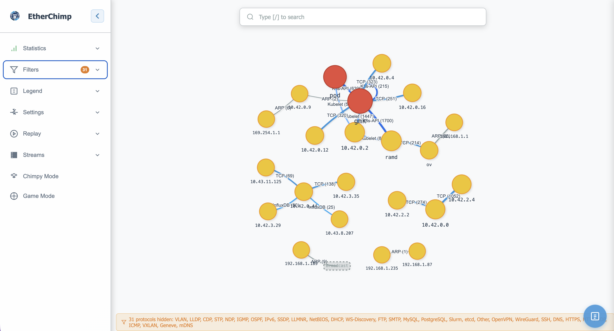

# Etherchimp

EtherChimp was created/inspired from EtherApe https://etherape.sourceforge.io/
The tool originated from CTFs with python3 scapy scripts that was converted into a fun web interface with claude



Live network traffic visualizer. Etherchimp captures packets from a network
interface (or replays a pcap), builds a real-time graph of hosts and the traffic
between them, and streams it to a browser over WebSocket — an interactive,
force-directed map of what's talking to what on your network.

## Features

- **Live capture** from a local interface, or **replay** from a pcap file
- **Real-time graph** of hosts and connections, streamed to the browser as deltas
- **Protocol-aware** classification (TCP/UDP, HTTP/S, DNS, SSH, ARP, ICMP, and more)
- **Multiple layouts** — force, circular, subnet, gravity, hierarchical
- **Remote capture** over SSH
- **Runs as a daemon** with automatic log rotation
- Served over **HTTPS** with a self-signed certificate

## Requirements

- Go 1.24+
- libpcap (`libpcap-dev` on Debian/Ubuntu, `libpcap` on macOS via Homebrew)
- Root/sudo for live capture (raw socket access)

## Build

```sh
go build -o etherchimp .
```

## Usage

Capture live from an interface:

```sh
sudo ./etherchimp -i eth0
```

Replay a capture file (no live capture, no root needed):

```sh
./etherchimp -f capture.pcap
```

Then open **https://localhost:8443** and accept the self-signed certificate warning.

### Common flags

| Flag | Default | Description |
|------|---------|-------------|
| `-i` | — | Interface to capture from, or `any` for all interfaces |
| `-f` | — | Pcap file for replay-only mode |
| `-p` | `8443` | HTTPS server port |
| `-ip` | `0.0.0.0` | Address to bind the server to |
| `-ssh` | — | Remote capture over SSH (`host:port`) |
| `-daemon` | — | Daemon control: `start`, `stop`, `status`, … |

Run `./etherchimp -h` for the full list (TLS hostnames, rate limiting, log rotation, SSH auth).

## License

See repository for license details.
